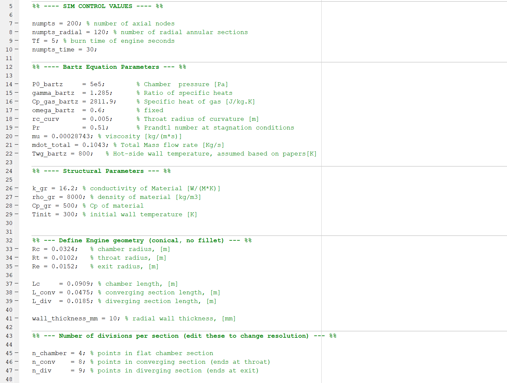
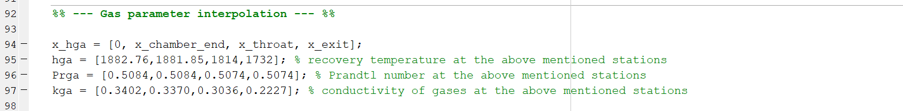
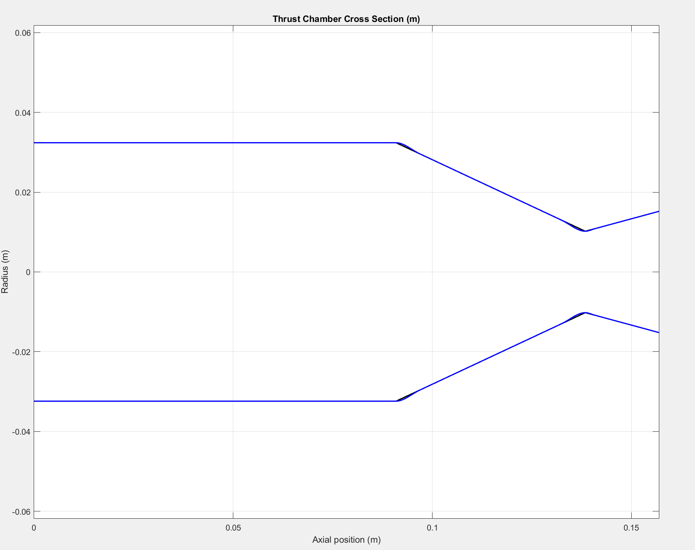
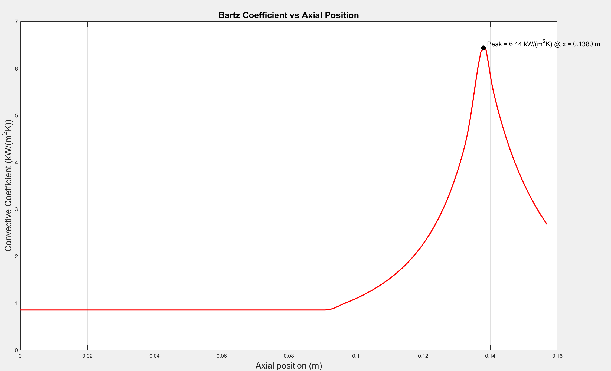
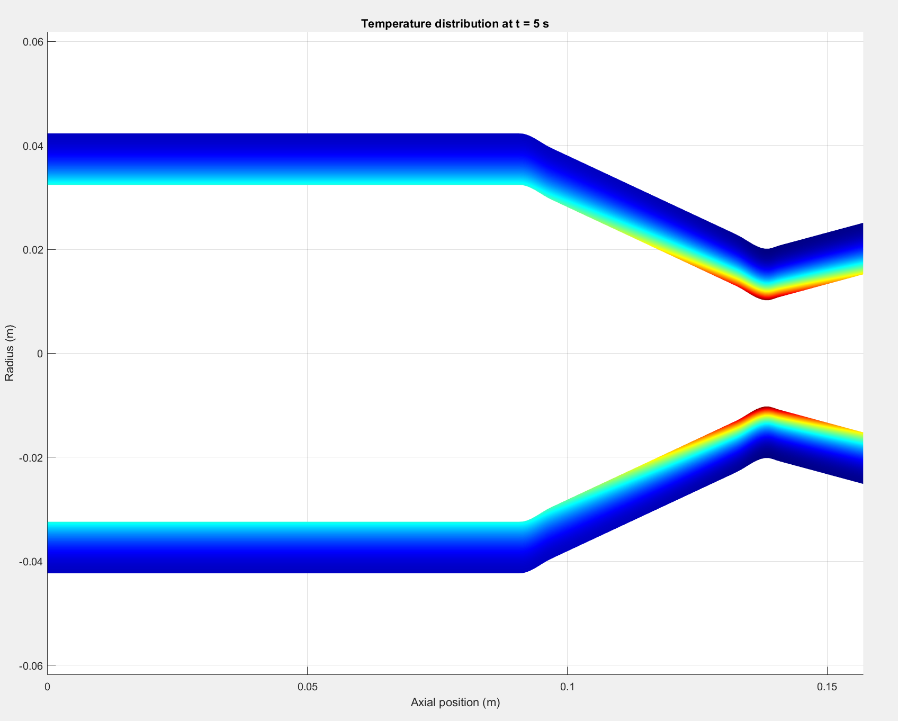
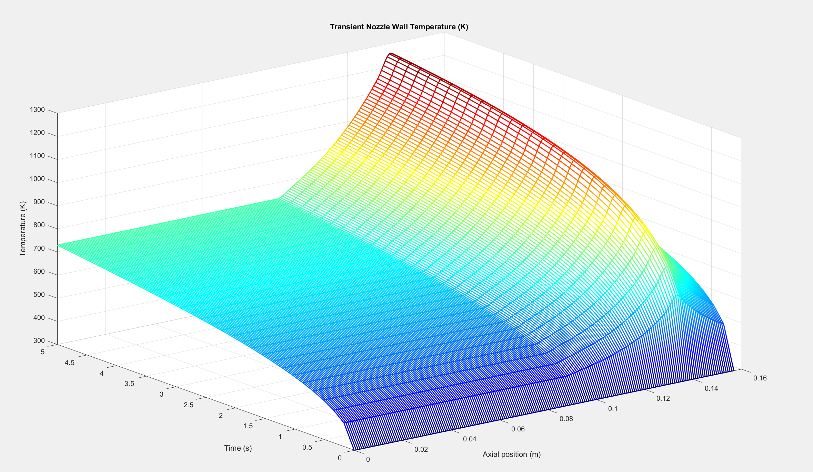
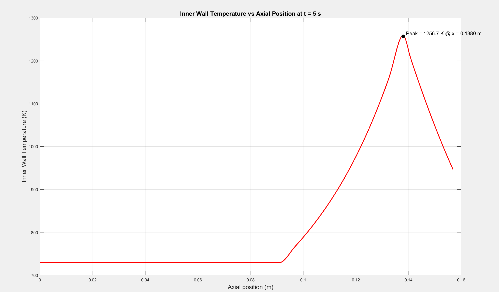

# Transient Heat Transfer Simulation — Rocket Nozzle Thermal Analysis

## Introduction

This tool models the **transient conductive-convective heat transfer** through
the wall of a liquid rocket engine's thrust chamber and nozzle during the burn.
Given the engine geometry and hot-gas-side conditions, it:

- Computes the local convective heat transfer coefficient along the engine
  axis using the **Bartz correlation**
- Discretizes the wall into radial "rings" at each axial station (a lumped
  parameter / thermal network model)
- Solves the transient temperature response of the wall over the burn
  duration using a matrix-exponential time-marching scheme
- Reports the **Biot number**, **peak heat transfer coefficient**, and
  **peak wall temperature**, and visualizes the full spatial/temporal
  temperature field

## Why This Was Needed

I was working on a design of small heat-sink rocket engine, one of the first design questions was whether a 10 mm thick stainless steel chamber wall could safely withstand the thermal loads during a short-duration burn. While high-fidelity Conjugate Heat Transfer, simulations in ANSYS Fluent can accurately predict wall temperatures, they are computationally expensive, require significant setup time, and demand prior CFD experience.

For early-stage engine design, a faster approach is often more practical. This MATLAB script provides a lightweight transient thermal analysis that estimates how the chamber wall temperature evolves during a burn using a one-dimensional heat conduction model. It allows rapid evaluation of wall thickness, burn duration, and thermal response before investing time in detailed CFD simulations.

The objective is not to replace CHT analysis, but to provide a quick preliminary design tool that helps determine whether a heat-sink engine concept is thermally feasible and guides early design decisions with minimal computational effort.

## How It Works

1. **Geometry** — the chamber/converging/diverging contour is built from a
   few key radii and lengths, then interpolated (`pchip`) onto a fine axial grid.
2. **Hot-gas-side heat transfer coefficient** — computed at every axial
   station via the Bartz equation, using local Mach number (from the
   area-Mach relation) and chamber conditions.
3. **Radial wall discretization** — the wall thickness at each axial
   station is split into `numpts_radial` annular rings.
4. **Transient solve** — a thermal network (conduction between rings +
   convection at the inner surface) is time-marched using `expm` for each
   axial station independently.
5. **Outputs** — Biot number check (validity of assumptions), 2D
   temperature field plots, and the transient temperature history.

## Configurable Parameters

The script is meant to be edited for your own engine/use case. The main
values you'll want to change are marked below — **screenshots of the
relevant lines are included so you can find them quickly.**

| Parameter(s) | What it controls | Location |
|---|---|---|
| `numpts`, `numpts_radial`, `numpts_time`,`Tf`| Simulation resolution (axial points, radial rings, time steps,Total burn duration  | Sim control block |
| `P0_bartz`, `gamma_bartz`, `Cp_gas_bartz`, `omega_bartz`, `rc_curv`, `Pr`,`mu`, `mdot_total` | Bartz equation / combustion gas properties | Bartz parameters block |
| `Twg_bartz` | Assumed hot-side wall temperature used in Bartz sigma correction | Bartz parameters section |
| `k_gr`, `rho_gr`, `Cp_gr` ,`Tinit`| Wall material properties (thermal conductivity, density, specific heat, inital wall temp) | Structural parameters block |
| `Rc`, `Rt`, `Re`, `Lc`, `L_conv`, `L_div` | Engine geometry (chamber/throat/exit radii and section lengths) | Engine geometry block |
| `wall_thickness_mm` | Radial wall thickness | Below geometry block |
| `x_hga`, `hga`, `Prga`, `kga` | Hot gas property profiles (enthalpy/heat coefficient, Prandtl, conductivity) vs. axial position | Gas parameter interpolation block |

**Sim control, Bartz, structural, and geometry parameters:**

## Results & Verification

The script reports the **maximum Biot number** across all radial slices to
confirm the lumped-parameter assumption is reasonable (`Bi << 1`). It also prints the **peak
convective heat transfer coefficient** and **peak inner-wall temperature**
at the end of the burn, along with their axial locations.

### Output plots produced by the script

**1. Chamber geometry check**

**2. Convective heat transfer coefficient vs. axial position**

For this example run, the peak convective coefficient is **6.44 kW/(m²K)
at x = 0.1380 m** (just upstream of the throat).

**3. 2D temperature distribution at the end of the burn**

**4. Transient wall temperature (inner surface) vs. time and axial position:**

**5. Inner wall temperature vs. axial position at the end of the burn**
(peak value marked):

For this example run, the peak inner-wall temperature at the end of a 5 s
burn is **1256.7 K at x = 0.1380 m** — consistent with the peak in the
convective coefficient, as expected since the hottest wall point should
track the point of highest heat transfer coefficient.

## Usage

1. Open `Transient_Nozzle_Wall_Temp.m` in MATLAB.
2. Edit the parameters listed in the [Configurable Parameters](#configurable-parameters)
   section to match your engine.
3. Run the script. Figures will be generated automatically, and peak values
   printed to the command window.

## Suggestions Welcome

This project is a work in progress, and I'm not a thermal/propulsion
expert, if you spot an error in the modeling assumptions, the
Bartz implementation, the discretization scheme, or anything else, please
open an issue or a pull request. Suggestions for improving accuracy,
performance, or usability are very welcome!
